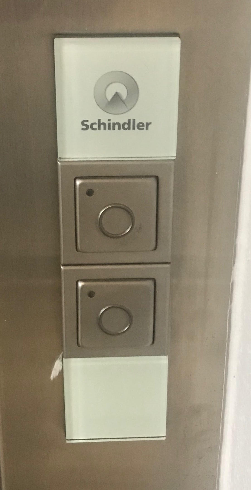
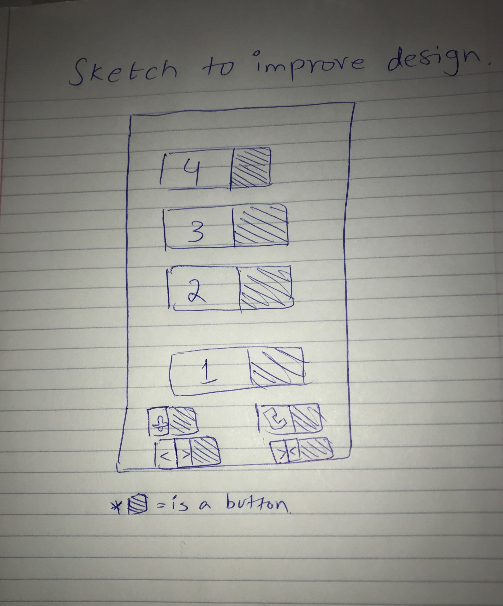

Home work 1 - Abdus Sami Yakoob

Link to my Github repository: https://github.com/abdussamiyakoob/hw1

Link to my presentation:  https://abdussamiyakoob.github.io/

Part C,

The Elevator I have chosen today is in Park East – Student Living

  

If you look at the buttons outside the elevator, there’s no arrow, just two buttons up and down with no signs. That can land up a lot of people into confusion because there needs to be a certain direction for a person to assume if he needs to go down or up.

Secondly, I do not see any emergency manual key lock to open the elevator doors for fire fighters or power failures in any kind of emergency situation. I noticed this after comparing it with the other elevator I saw at the same apartment but the north side building.

Furthermore, I think the door open and close button should not be placed together. It creates a lot of confusion and a lot of people including me have encountered pressing a wrong button to open or close the elevator door. Both buttons should be placed a bit distantly.

Same goes for the call and alarm button, they should be placed a bit distant. 

Another thing that I have compared and noticed about this elevator is that, it does not have a proper sensor to detect if someone’s is in a way when a door is closing so until and unless you don’t touch the elevator door it won’t detect.

Part B,

I use the elevator usually to go up to the fourth floor and interface is pretty good at making that thing clear as you can see the button are listed vertically showing the 4th floor at the top until 1st floor which is at the very bottom.

The common sequence of action is entering the elevator by calling the up or down button then pressing the button according to the location of what floor you’re going to. If you’re going to the top floor for example, the most common user interaction would be to press the top button on the elevator. Moreover, a user can press open or close door button too.

After pressing the up or down button, when the elevator arrives it announces either if it’s going up or down. And at every floor it announces the floor number so that’s how the elevator provides the feedback.

The most common mistake that a lot of people can make from this design is pressing the wrong door open or close button. Other than that, maybe by mistake pressing the up button to go down.

The improvement I’ve made on the sketch is to add a little space between both the buttons to make the interface as simple as possible.

